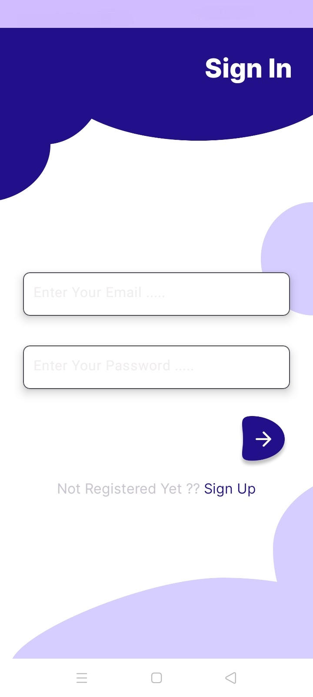
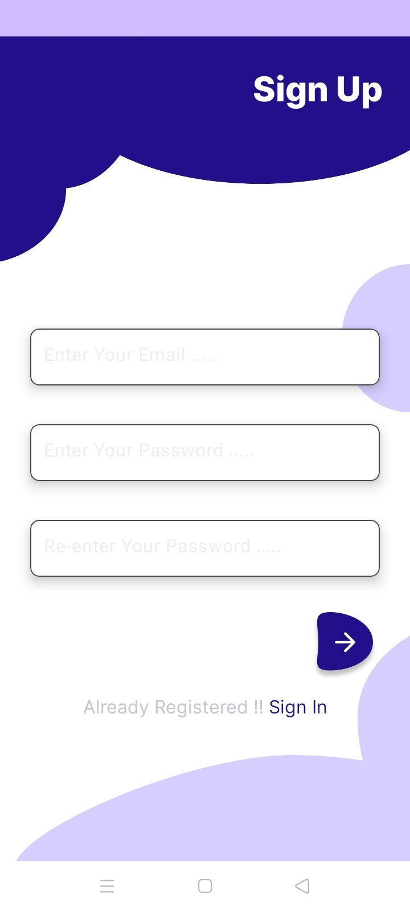
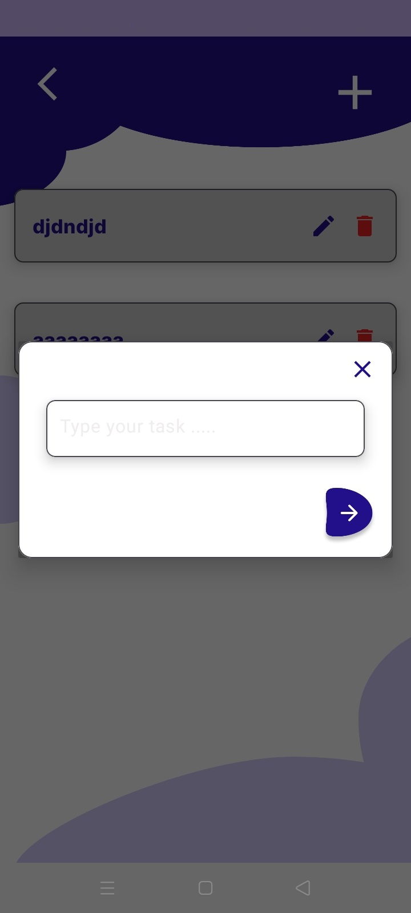
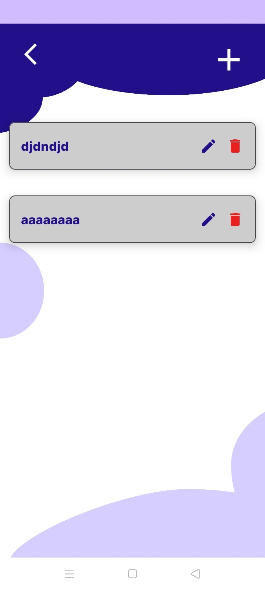

# TODO Uygulaması README

Bu proje, kullanıcıların yapılacak görevleri kolayca yönetmelerine yardımcı olmak amacıyla geliştirilmiş bir TODO uygulamasını içerir.

## Özellikler
-kullanıcı giriş islemleri 
- Yeni görevler ekleyebilirsiniz.
- Varolan görevleri düzenleyebilir veya silebilirsiniz.

## Kurulum

1. Bu projeyi klonlayın:
2. Proje klasörüne gidin:
3. Gerekli bağımlılıkları yüklemek için aşağıdaki komutları kullanın:
4. Uygulamayı başlatın:

## Katkıda Bulunma

Katkılarınızı memnuniyetle karşılıyoruz! Eğer projeye katkıda bulunmak isterseniz:

1. Projeyi çatallayın (fork) ve kendi hesabınıza klonlayın.
2. Yeni bir dal (branch) oluşturarak değişikliklerinizi yapın.
3. Değişikliklerinizi ana projeye göndermek için bir çekme isteği (pull request) oluşturun.
